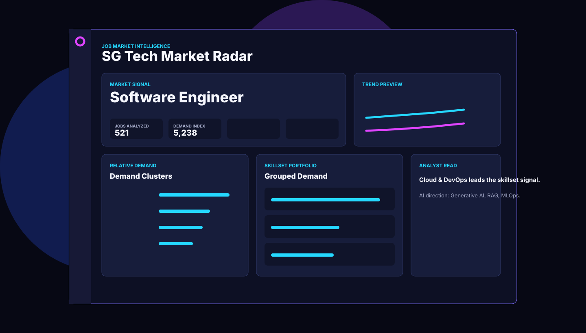
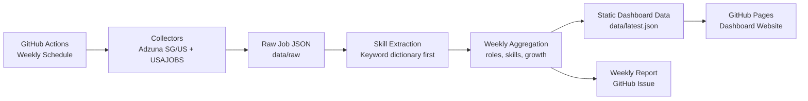
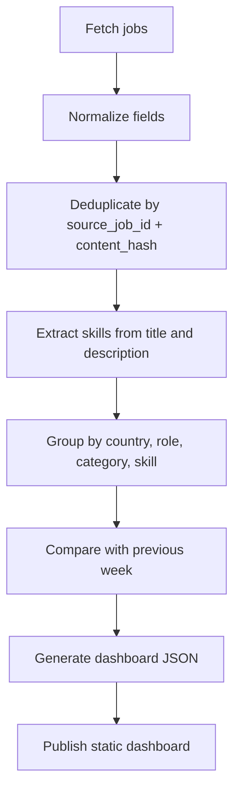

# SG/US Market Skill Radar


SG/US Market Skill Radar is a weekly job-market intelligence dashboard. It tracks job postings in Singapore and the United States, extracts recurring skills, compares weekly movement, and turns market signals into project ideas.

The first version is designed as a **zero-cost MVP** using GitHub Actions, GitHub Pages, static JSON files, and public job APIs.

<p>
  
  
  
</p>

## Dashboard Preview



## Product Goal

Help answer one practical question every week:

> Based on SG and US job market trends, what skills should I learn and what project should I build next?

## MVP Scope

| Area | Decision |
| --- | --- |
| Markets | Singapore and United States only |
| Industry | All industries |
| Data sources | Adzuna SG, Adzuna US, USAJOBS |
| Storage | JSON files committed into the repository |
| Dashboard | Static website hosted on GitHub Pages |
| Report | Weekly GitHub Issue, later email |
| Cost | Free-first infrastructure |

## Architecture

The detailed editable diagram is available at [docs/market-skill-radar.drawio](docs/market-skill-radar.drawio).



## Data Pipeline



## Dashboard Modules

| Module | What It Shows |
| --- | --- |
| Market Overview | Total postings, SG vs US split, top categories |
| Role Trends | Most common roles and fastest-growing roles |
| Skill Radar | Top skills, growing skills, declining skills |
| Skillset Portfolio | Skills grouped into Frontend, Backend, Cloud & DevOps, AI & Data, Security, and BI & Analytics |
| Skill Combos | Common combinations like `Python + SQL` |
| Salary Signals | Salary ranges where available |
| Evidence Trail | Representative job postings with matched skills and source query |
| Project Ideas | Suggested portfolio projects based on demand signals |

## Repo Structure

```text
market-skill-radar/
  .github/workflows/
    weekly-market-radar.yml

  assets/icons/
    dashboard.svg
    github-actions.svg
    radar.svg

  dashboard/
    index.html
    app.js
    styles.css

  data/
    raw/
    weekly/
    latest.json

  docs/
    market-skill-radar.drawio
    schema.md

  scripts/
    aggregate_weekly.py
    collect_adzuna.py
    collect_usajobs.py
    create_slack_digest.py
    create_report.py
    extract_skills.py

  skills.yml
```

## Data Sources

| Source | Market | Why Use It |
| --- | --- | --- |
| Adzuna API | SG + US | Broad job aggregation with official API |
| USAJOBS API | US | Official US government job data |
| MyCareersFuture | SG | Important future candidate, needs legal and technical review |

## Weekly Report Shape

Each Slack or email report should include:

```text
1. SG vs US hiring volume
2. Top 20 skills
3. Fastest-growing skills
4. Top role families
5. Interesting SG/US differences
6. Suggested project ideas
7. One recommended skill focus for the week
```

Create a Slack-ready digest locally:

```bash
python3 scripts/create_slack_digest.py --dashboard-url http://localhost:8000/dashboard/
```

## Environment Variables

The weekly GitHub Actions job needs these repository secrets:

```text
ADZUNA_APP_ID
ADZUNA_APP_KEY
```

Optional repository variable:

```text
DASHBOARD_URL
```

For local development, copy [.env.example](.env.example) and fill in the values locally. Do not commit real keys. GitHub provides `GITHUB_TOKEN` automatically inside Actions, so it does not need to be added manually.

## Weekly Automation

The workflow lives at [.github/workflows/weekly-market-radar.yml](.github/workflows/weekly-market-radar.yml).

It runs automatically every Monday at 09:00 Singapore/Malaysia time and can also be started manually from GitHub Actions with `workflow_dispatch`.

Default weekly run:

```text
country: sg
pages per tracked topic: 3
tracked topics: software, frontend, backend, AI, ML, cloud, DevOps, data, cybersecurity
```

The workflow writes:

```text
data/latest.json
data/weekly/latest_YYYY-MM-DD.json
data/weekly/slack_digest.md
```

Raw API responses stay ignored by git. This keeps the public repository cleaner and avoids publishing source-specific tracking details.

## Start Collecting Data

The first collector is SG-first by default:

```bash
python3 scripts/collect_adzuna.py --countries sg --pages 3
```

When SG looks good, add US:

```bash
python3 scripts/collect_adzuna.py --countries sg us --pages 3
```

Useful safe test without API calls:

```bash
python3 scripts/collect_adzuna.py --countries sg --pages 1 --dry-run
```

Output files are split by market:

```text
data/raw/adzuna_sg_YYYY-MM-DD.json
data/raw/adzuna_us_YYYY-MM-DD.json
```

Raw API output is ignored by git because it can contain source tracking parameters. The public dashboard uses sanitized aggregated data from:

```text
data/latest.json
```

The dashboard includes a trust layer:

```text
- sampled job count
- search segments used
- grouped skillset methodology
- representative postings
- known limitations
```

## Development Roadmap

### Phase 1: Blueprint

- [x] Define free MVP infrastructure
- [x] Create repo skeleton
- [x] Add README and architecture diagram
- [x] Draft data schema

### Phase 2: Local Data Prototype

- [x] Implement Adzuna collector
- [ ] Implement USAJOBS collector
- [x] Save normalized raw jobs
- [x] Add basic deduplication

### Phase 3: Intelligence Layer

- [x] Build skill dictionary
- [x] Extract skills from job descriptions
- [x] Aggregate weekly stats
- [ ] Compare week-over-week growth

### Phase 4: Dashboard

- [x] Build static dashboard UI
- [x] Render top roles and skills
- [ ] Add SG vs US filters
- [x] Add project recommendation panel

### Phase 5: Automation

- [x] Run pipeline weekly with GitHub Actions
- [ ] Publish GitHub Pages
- [x] Create Slack digest preview

## Design Direction

The dashboard should feel like a practical analyst workspace:

- Dense but readable
- Neutral background with strong data accents
- Charts focused on comparison and weekly movement
- No landing page first; the dashboard is the product

## Future Upgrade Path

When the free MVP becomes useful, the next infra version can move to:

```text
Vercel + Supabase + Resend
```

That would add database queries, better email delivery, and more flexible dashboard filtering.
